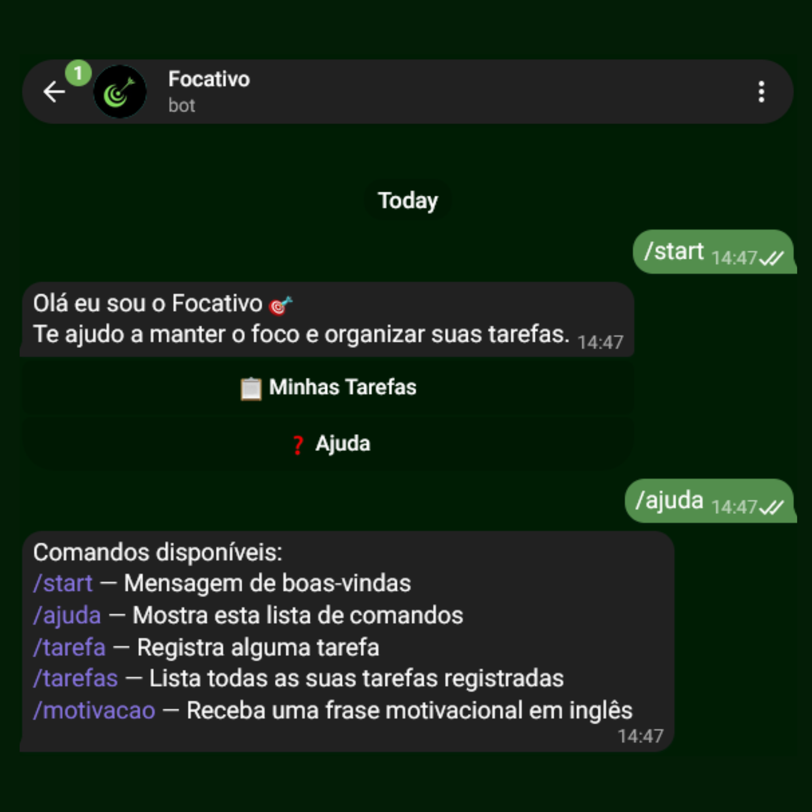
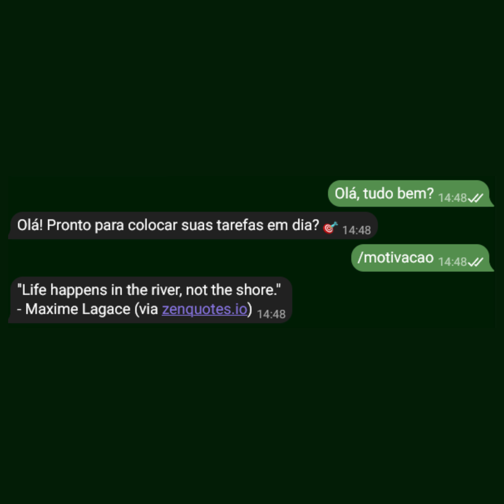
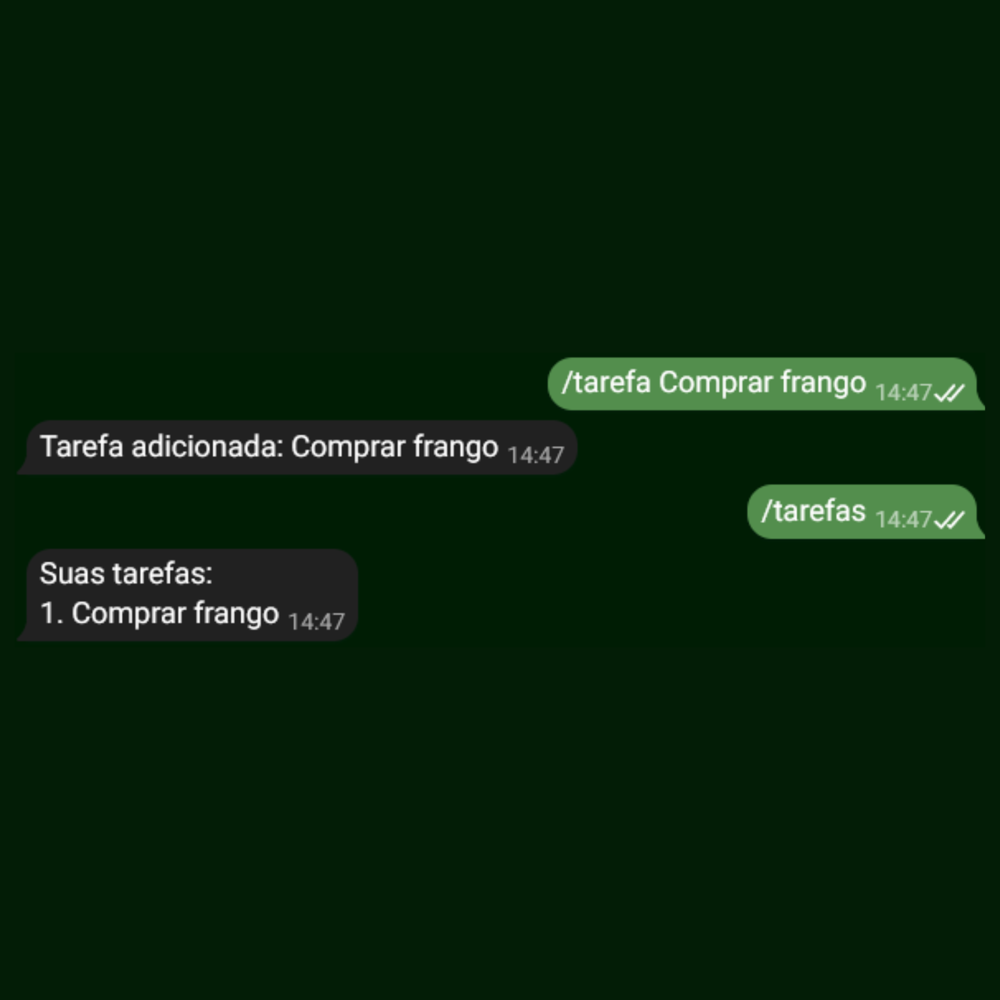

# Focativo Bot 🎯

Bot de produtividade para Telegram: gerencia tarefas e ajuda a manter o foco, respondendo automaticamente a comando e mensagens de texto, além de enviar uma frase motivacional em inglês para ajudar no desenvolvimento da linguagem.

## Sobre este projeto

Este bot foi construído como projeto prático de aprendizado, com foco em consumir APIs externas, lidar com programação assíncrona em Python e praticar boas práticas de desenvolvimento. Foi minha primeira experiência com algum tipo de API e com bibliotecas assíncronas em Python.

## Comandos disponíveis

- `/start` — mensagem de boas-vindas
- `/ajuda` — lista os comandos disponíveis
- `/tarefa <descrição>` —  adiciona uma tarefa (ex: `/tarefa Estudar Python`)
- `/tarefas` — lista as tarefas pendentes
- `/motivacao` — envia uma frase motivacional em inglês

## Tecnologias
- Python 3.10+
- python-telegram-bot
- python-dotenv
- requests
- Frases via [ZenQuotes API](https://zenquotes.io/)

## Como rodar localmente

1. Clone o repositório: `git clone https://github.com/thiagoferlopes/focativo-bot.git`
2.  Crie e ative um ambiente virtual, depois instale as dependências: `pip install -r requirements.txt`
3. Copie o `.env.example` para `.env` e preencha com o seu token: `TELEGRAM_TOKEN=seu_token`
4. Rode python bot.py

## Decisões do projeto
- Validação de tamanho máximo por tarefa, para evitar estourar o limite de caracteres do telegram.
- Handler de erro global, garantindo que o usuário sempre receba um retorno se algo falhar internamente